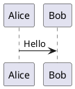

# Neovim configuration

Personal Neovim configuration targeting Neovim `0.12.x`.

The config is managed by `lazy.nvim`, commits `lazy-lock.json` for plugin
reproducibility, and uses Mason for external language servers, formatters,
and linters.

## Requirements

- Neovim `0.12.x`
- Git, required by the lazy.nvim bootstrap and plugin installs
- `curl`, `tar`, a C compiler, and a working `tree-sitter` CLI for optional
  non-bundled Treesitter parser installation
- ImageMagick for inline image rendering through `image.nvim`
- Kitty or another terminal with Kitty graphics protocol support for inline
  image display
- `plantuml`, Java, and Graphviz for PlantUML diagram rendering
- `rg`, used by `grepprg` and `fzf-lua`

The first Neovim start bootstraps `lazy.nvim` automatically. External tools are
installed by Mason after the plugins are restored.

## Restore And Update

After cloning or updating this config, restore the pinned plugin set:

```sh
nvim --headless "+Lazy! restore" +qa
```

Or run this interactively from Neovim:

```vim
:Lazy restore
```

Install external tools declared in [mason.lua](lua/plugins/mason.lua):

```vim
:MasonToolsInstall
```

The Mason tool list includes LSP servers, formatters, and linters. Neovim
prepends Mason's `bin` directory to `PATH`, so tools installed by Mason are
visible to LSP and formatting integrations.

Treesitter parser installation uses an existing `tree-sitter` CLI when one is
available and passes `tree-sitter --version`. This config intentionally does not
install `tree-sitter-cli` through Mason because Mason's prebuilt CLI can require
a newer system `glibc` than this workstation provides. Neovim-bundled parsers
are preferred for languages Neovim ships itself, keeping parser versions aligned
with Neovim's bundled runtime queries.

Only refresh pinned plugin versions intentionally:

```vim
:Lazy update
```

Review `lazy-lock.json` diffs together with the config changes that required the
plugin update.

## Maintenance Checks

Run the local check suite before and after config changes:

```sh
make check
```

The default suite checks Lua syntax, verifies headless startup, runs focused
Neovim health checks for lazy.nvim, LSP, and Treesitter, and verifies Lua
formatting with StyLua.

Formatting can also be checked on its own:

```sh
make check-format
```

## Preferences

| Setting | Value |
| ------- | ----- |
| Leader | Space |
| Insert escape | `jj` |
| Colorscheme | Dracula |
| Sign column | Always visible |
| Color column | 80 |
| Indentation default | 4 spaces |
| Grep backend | `rg --vimgrep` |
| Notes vault | `~/notes` |

Language-specific overrides live in `after/ftplugin/`.

## Note-Taking

The note-taking setup uses a plain Markdown vault with Obsidian-compatible
conventions:

- `obsidian.nvim` for note creation, daily notes, templates, links, backlinks,
  tags, and note search
- Marksman as the Markdown LSP
- `render-markdown.nvim` for readable in-editor Markdown
- `image.nvim` for Kitty-protocol inline images
- `diagram.nvim` for inline Mermaid and PlantUML diagrams
- `fzf-lua` and `rg` for raw full-text retrieval

The configured vault is `~/notes`. The config does not create it automatically.
Create the initial structure with:

```sh
mkdir -p "$HOME"/notes/{inbox,daily,projects,areas,resources,permanent,attachments/images,attachments/files,templates}
cd "$HOME/notes"
git init
touch .marksman.toml
```

Marksman needs either `.marksman.toml` or a Git repository at the vault root for
cross-file references and completions. Keeping both is fine: Git gives history,
and `.marksman.toml` makes the Markdown project root explicit.

Daily notes use `~/notes/daily/YYYY-MM-DD.md` and look for a template at
`~/notes/templates/daily.md`. A minimal daily template:

```markdown
---
tags: [daily]
created: {{date}}
---

# {{date}}

## Log

-

## Follow-ups

- [ ]
```

New titled notes use readable slugs such as
`neovim-note-taking-setup.md`. Untitled notes fall back to a timestamp ID.

Inline images render local Markdown image links:

```markdown

```

Remote image downloading is disabled by default. Store note images under
`attachments/images` or another local path relative to the Markdown file. For
files inside the configured `~/notes` vault, inline image rendering also checks
Obsidian-style vault paths and bare filenames in `~/notes/attachments/images`,
so `` can resolve to an attachment there.

Mermaid and PlantUML diagrams render from fenced code blocks:

````markdown



````

Diagram rendering runs automatically on Markdown buffer entry and after edits
settle. Use `<leader>ng` to toggle inline graphics for the current note-taking
session, including both Markdown images and rendered diagrams. Use `<leader>np`
with the cursor inside a diagram block to open the rendered diagram image in a
preview tab; press `o` there to open the same image in the system viewer.
Mermaid rendering uses `mmdc`, which is declared in the Mason tool list, plus
the local Puppeteer config in
[resources/mermaid-puppeteer.json](resources/mermaid-puppeteer.json) so
Chromium starts with `--no-sandbox` when diagrams render.

## Plugins

### Core And Tooling

| Plugin | Purpose |
| ------ | ------- |
| `lazy.nvim` | Plugin manager and lockfile restore/update workflow |
| `mason.nvim` | External tool installer |
| `mason-tool-installer.nvim` | Declarative Mason tool installation |
| `lazydev.nvim` | Lua development support for Neovim config files |

### LSP, Completion, Formatting

| Plugin | Purpose |
| ------ | ------- |
| `blink.cmp` | Completion engine |
| `blink-copilot` | Copilot source for completion |
| `blink-emoji.nvim` | Emoji completion source |
| `copilot.vim` | GitHub Copilot integration |
| `LuaSnip` | Snippet engine |
| `friendly-snippets` | Snippet collection |
| `conform.nvim` | Formatting |
| `tiny-inline-diagnostic.nvim` | Inline diagnostic display |

### Languages

| Plugin | Purpose |
| ------ | ------- |
| `nvim-treesitter` | Parser management and Treesitter queries |
| `treesitter-parser-registry` | Parser registry used by current Treesitter setup |

Configured language focus: Lua, Go, Python, Bash, YAML/Ansible, and
Bazel/Starlark. Markdown notes are covered by Treesitter and Marksman.

### Notes And Markdown

| Plugin | Purpose |
| ------ | ------- |
| `obsidian.nvim` | Markdown vault workflow, backlinks, tags, daily notes, and templates |
| `render-markdown.nvim` | In-editor Markdown rendering and Markdown completions |
| `image.nvim` | Kitty-protocol inline images in Markdown |
| `diagram.nvim` | Inline Mermaid and PlantUML diagram rendering |

Obsidian's UI layer is disabled so render-markdown owns Markdown rendering,
including checkboxes, list bullets, callouts, links, and anti-conceal behavior.
Obsidian remains responsible for vault workflows such as note creation, daily
notes, templates, backlinks, tags, links, and checkbox actions.
Markdown heading rendering uses custom Dracula-aligned highlights with subtle
block-width backgrounds; H1 is bold and underlined, and H2 is bold.
Markdown buffers hard-wrap typed prose at 80 columns while still allowing longer
lines, with list-aware continuation indentation and visual wrap indentation.

### Git

| Plugin | Purpose |
| ------ | ------- |
| `vim-fugitive` | Git commands |
| `gitsigns.nvim` | Git signs, blame, hunk actions |
| `hydra.nvim` | Temporary Git hunk action mode |

### Navigation And Search

| Plugin | Purpose |
| ------ | ------- |
| `fzf-lua` | File, buffer, and grep pickers |
| `nvim-bqf` | Better quickfix window |
| `neo-tree.nvim` | File tree and Git status tree |
| `smart-splits.nvim` | Window movement and resizing shared with Kitty |
| `kitty-scrollback.nvim` | Kitty scrollback integration |

### UI And Editing

| Plugin | Purpose |
| ------ | ------- |
| `lualine.nvim` | Statusline |
| `tabby.nvim` | Tabline |
| `indent-blankline.nvim` | Indentation guides |
| `nvim-autopairs` | Automatic pair insertion |
| `nvim-web-devicons` | Icons used by UI plugins |

### Themes

| Plugin | Purpose |
| ------ | ------- |
| `dracula.nvim` | Active colorscheme |
| `bamboo.nvim` | Optional colorscheme |
| `gruvbox.nvim` | Optional colorscheme |
| `nightfox.nvim` | Optional colorscheme |
| `tokyonight.nvim` | Optional colorscheme |

### Dependencies

Some plugins are installed as dependencies rather than configured directly:
`plenary.nvim`, `nui.nvim`, `window-picker`, and `fzf`.

## Keybindings

`<leader>` is Space.

### General

| Keybinding | Mode | Description |
| ---------- | ---- | ----------- |
| `jj` | Insert | Exit insert mode |
| `:B` | Command | Open buffer picker |
| `:F` | Command | Open file picker |

### Search

| Keybinding | Description |
| ---------- | ----------- |
| `<leader>b` | Fuzzy search buffers |
| `<leader>f` | Fuzzy search files |
| `<leader>ll` | Live grep |
| `<leader>lg` | Live grep with glob |
| `<leader>lr` | Resume live grep |

### Notes

| Keybinding | Description |
| ---------- | ----------- |
| `<leader>nn` | New note |
| `<leader>no` | Open note |
| `<leader>ns` | Search notes |
| `<leader>nb` | Show backlinks |
| `<leader>nt` | Browse note tags |
| `<leader>nd` | Open daily note |
| `<leader>nl` | Show links in note |
| `<leader>nr` | Rename note |
| `<leader>nT` | Insert note template |
| `<leader>nf` | Follow note link |
| `<leader>ng` | Toggle inline note graphics |
| `<leader>np` | Preview diagram image under cursor |

### Windows

| Keybinding | Description |
| ---------- | ----------- |
| `<C-h>` | Move cursor to window left |
| `<C-j>` | Move cursor to window below |
| `<C-k>` | Move cursor to window above |
| `<C-l>` | Move cursor to window right |
| `<A-h>` | Resize window left |
| `<A-j>` | Resize window down |
| `<A-k>` | Resize window up |
| `<A-l>` | Resize window right |
| `<leader><leader>h` | Swap buffer left |
| `<leader><leader>j` | Swap buffer down |
| `<leader><leader>k` | Swap buffer up |
| `<leader><leader>l` | Swap buffer right |

### Tabs

| Keybinding | Description |
| ---------- | ----------- |
| `<leader>ta` | Add tab |
| `<leader>tc` | Close tab |
| `<leader>to` | Close all other tabs |
| `<leader>tr` | Rename tab |
| `<leader>tn` | Go to next tab |
| `<leader>tp` | Go to previous tab |
| `<leader>tj` | Start jump mode |
| `<leader>tmp` | Move tab backward |
| `<leader>tmn` | Move tab forward |

### File Tree

| Keybinding | Description |
| ---------- | ----------- |
| `<leader>tt` | Toggle Neo-tree |
| `<leader>tf` | Reveal current file in Neo-tree |
| `<leader>ts` | Show Neo-tree Git status |

### Git

| Keybinding | Description |
| ---------- | ----------- |
| `<leader>gb` | Toggle current line blame |
| `<leader>h` | Enter Git hunk Hydra |

Inside the Git hunk Hydra:

| Keybinding | Description |
| ---------- | ----------- |
| `n` | Next hunk |
| `p` | Previous hunk |
| `s` | Stage hunk |
| `u` | Undo last staged hunk |
| `R` | Reset hunk |
| `P` | Preview hunk |
| `q`, `;`, `<Esc>` | Exit Hydra |

### Diagnostics And Formatting

| Keybinding | Description |
| ---------- | ----------- |
| `<leader>d` | Send diagnostics to the location list |
| `<leader>dt` | Toggle inline diagnostics |
| `<leader>D` | Send diagnostics to the quickfix list |
| `<leader>F` | Format current buffer |

## Layout

Top-level config entrypoint:

| File | Purpose |
| ---- | ------- |
| `init.lua` | Loads config modules, plugins, colorscheme, and LSP setup |
| `lua/config/options.lua` | Editor options |
| `lua/config/keymaps.lua` | Core keymaps |
| `lua/config/autocmds.lua` | Core autocmds and highlights |
| `lua/config/commands.lua` | User commands |
| `lua/config/lazy.lua` | lazy.nvim bootstrap and setup |
| `lua/config/lsp.lua` | LSP enablement and diagnostic behavior |
| `lua/plugins/*.lua` | Plugin specs |
| `lsp/*.lua` | Per-server LSP configs |
| `after/ftplugin/*.lua` | Filetype-local settings |
